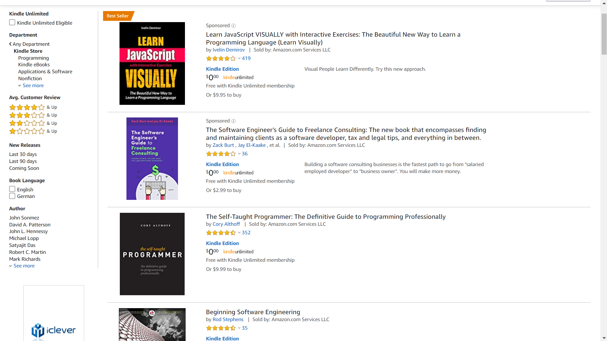

## Programming with Design in Mind
The architecture of a house consists of many components that are similar to each other if not the same piece. The beams and bricks used to build
the base foundation of a house to the symmetric design for an aesthetic appeal. Bits and pieces of a house or practically any structure are seen
throughout blueprints to be repetitive. Meaning that it is seen to be used more than one time. Now, this isn't a bad thing because life itself consists
of recurring patterns. From flowers in fields to the stars, we gaze above. Now in the context of software engineering, this is no different. We create
a software where sections of code may easily be used. For instance, a site like Amazon.com, consist of many pieces that look the same.

 

 From this screenshot, we can see that each of those books follow the same format. A picture of the book, the name of the book, the rating, the price, and more are positioned the same. Now this concept of solving recurring problems can be solved in various ways but mostly depends on what you the architect decides to use. React for example is structured around using a component design, in which pieces of code can easily be reused to solve
to make software engineering quick and efficient. Even Object Oriented Programming has classes to help make coding convenient and easier to solve problems.

## Back to Building that House
Houses are built differently depending on where the house is located. For instance, a house in Hawaii would be slightly different than a house to Alaska
is due to how different the climate is in both areas. Hawaii which is more hot and tropical would want a design in which ventilation is nice and cool, while
Alaska house architecture probably wants to have a design that will keep people warm. In a more broad view, many houses share the same design in creating the foundation of a house. There are a few set standards that most architects follow to help maintain and create houses with strong integrity.

## The House that I am Building
Throughout my project Ono-otw, many components make up the structure of the project. Many repetitive sections can be seen through the application. Whether it be our food cards to our menu cards, we recycle and re-use components throughout our application to develop in a fast and more efficient matter. For instance, rather than hard coding all these pieces, we can just simply re-use a piece to maintain our design pattern. 