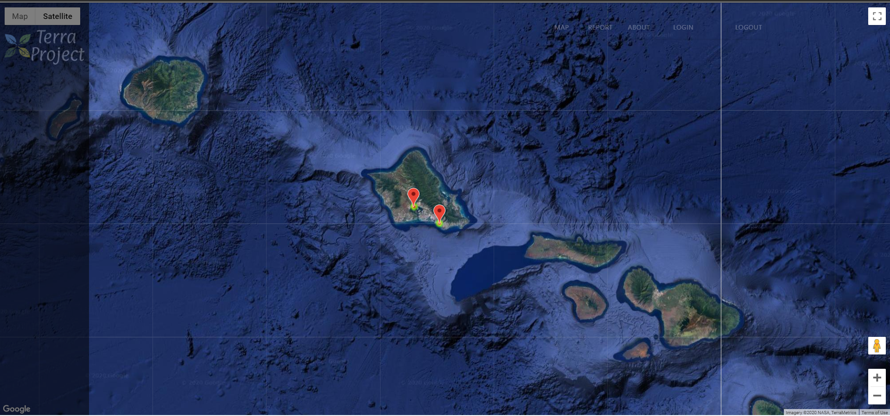

## COVID-19 A.K.A The Corona Virus

We all probaly know what this pandemic is causing across the world. But let me remind you what it is and how its affecting the world. The Coronavirus is a highly infectious disease commonly refered to as COVID-19 that causes respiratory illness similar to the flu. Also, this disease causes our own immune system to turn against itself. This is really terrifying as a lot of elderly people and those with health problems are at high risk of servre symptoms and possibly death. The rate of virus is truly exponential. Something small such as coughing and sneezing can easily effect a large group of people. This is mainly due to the main form of this virus's spread is through cough dropletts. This Pandemic is serveing impacting the world. Not only is the death count rapidly rising, but also the economy is slowly dying. Tourism and travel compaines are losing money to the point where some of them have to file bankrupcty.  Also a bunch of workers are being laid off in order to prevent the spread of the Corona. To help aid against this the U.S. Government is now giving $1200 to each U.S. Citizen.  

## My Daily Life Routine

My life has changed a lot due to the Corona Virus. For starters my sleep schedule has completely changed. With most of my classes not requiring us to meet online on Zoom, but insteads assigns online work, I didn't see the reason to sleep early. Normally I would sleep around 11 PM and wake around 6 AM, but now I sleep at 4 AM and wake up at 2 PM. This opens up a lot of flexible free time. Now I try to work out more often at home since, I didn't had time before the Corona Pandemic. Since, my job as an Overnight ITS Help Desk Consultant at UH Manoa is an essential service I have to bus all the way to UH Manoa from Waipahu. Normally I would just stay at the ICSpace after all my classes are over, but now I have to leave my house at 9:00 in order to make in time for my 11 PM shift. Since, I leave my house twice a week to go to work, my aunty gives a N95 mask and gloves to wear everytime I leave the house. Never had I ever experience so much aneixty on the bus. I become so paronid of every surface I touch and the people who are around me. It feels like I'm fending for life. The work at my job hasn't changed much. At first I thought since UH Manoa is all doing online classes, we would have much more help tickets that we would need to do, but the amount we recieved each night is pretty much the same. The only thing that I see as a positive change is the fact that I spend less money on takeout food, since I am mostly at home and can eat home cooked meal.

## Online College Courses
First, I want to start off by mentioning how much I hate online classes. Whenever my class does a Zoom meeting to do classwork and activites, we move through the content way too fast. For instance, in one of my math classes we breeze throught a whole concept that wasn't properly explained and this causes most of us to struggle with the classwork assignments. Also, since all the courses are online, students are forced to be more self-discpline. This makes sense since this is college, and we are supposed to be self-discpline, but for some of us it is a little hard to adjust especially with the immediate change to online. As I mentioned eariler, I now have a lot of free time which is one of the few benefits I see with online classes. 

## My Life as an Aspring Software Engineer

Now due to all the potential free time I have, I am trying to take this oppurtunity to expand on my Software Engineering skills and develop projects. One project I am currently working on is a companionship application, that people can use to socially interact with one another via call, virtualy board games and much more. This is to help combat the social isolation that humanity must face in order to beat the Corona Virus. Another application I am working on is a Corona Virus Map and Data Visualizer. I know that there may be a lot of these existing already but I wanted to make one since I have an interest in Data Science and Data Visualization. I plan to have heatmaps, charts, graphs and other visual aid but with a very aesthetically appealing design. I am really excited about these two projects because it motivates me to learn new tools and software. For instance, the Companion Application I mentioned is actually going to be a Mobile Application that my team and I plan to publish this month. I am tasked with the mobile client of the application, and because of that I decided to self-teach React Native. It gets really interesting as well decided to use the MERN (MongoDB, Express.js, React.js, and Node.js) Tech Stack. Also, with these 2 projects, I am learning how to use new API's such as Stripe (Transaction API) and the Corona Virus Data API. 
 

### P.S. STAY SAFE!!! ALSO DON'T Forget TO:

