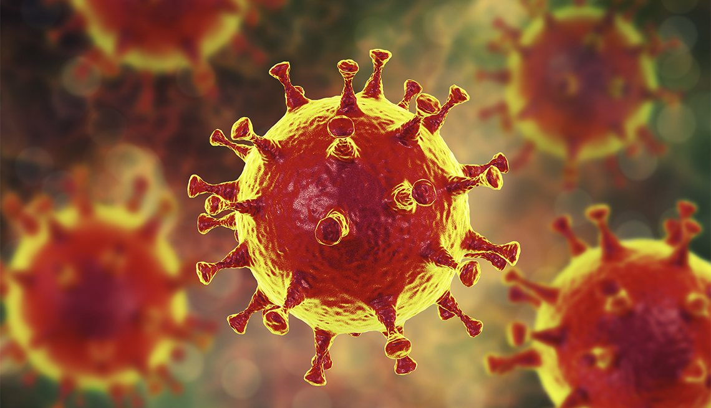
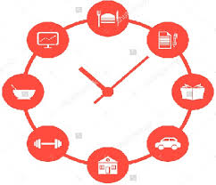
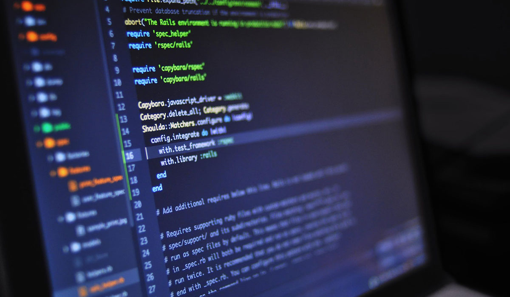
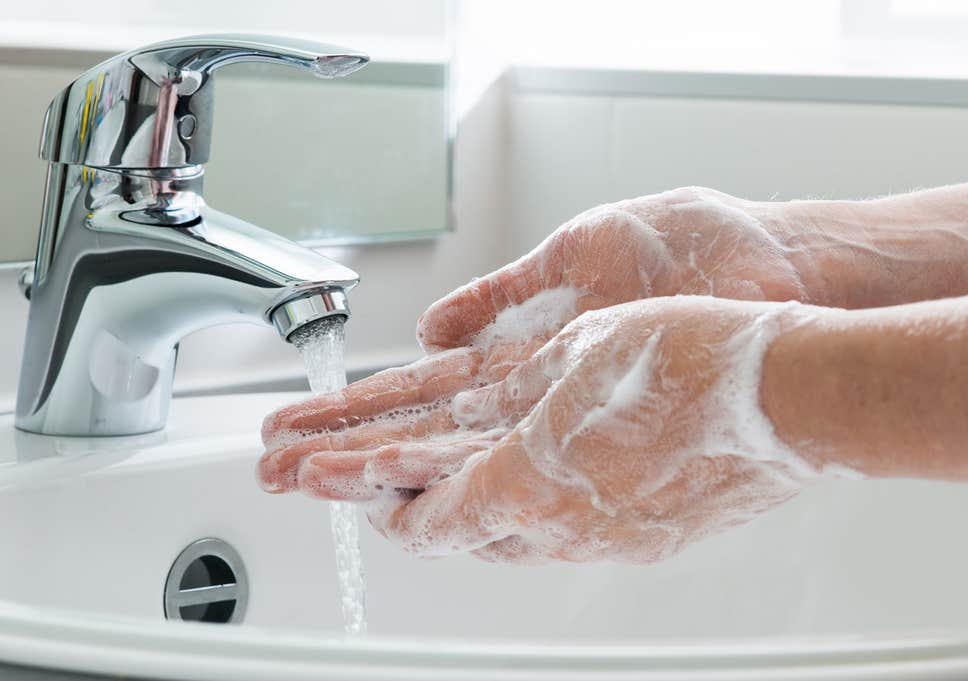

## COVID-19 A.K.A The Corona Virus

We all probably know what this pandemic is that's rapidly spreading throughout the world. But let me remind you what it is and how it's affecting the world. The Coronavirus is a highly infectious disease commonly referred to as COVID-19 that causes a respiratory illness similar to the flu. Also, this disease causes our immune system to turn against itself. This is terrifying as a lot of elderly people and those with health problems are at high risk of severe symptoms and possibly death. The rate of the virus is truly exponential. Something small such as coughing and sneezing can easily infect a large group of people. This is mainly due to the main form of this virus's spread is through cough droplets. This pandemic is severely impacting the world. Not only is the death count rapidly rising, but also the economy is slowly dying. Tourism and travel companies are losing money to the point where some of them have to file bankruptcy.  Also, a bunch of workers are being laid off to prevent the spread of the Corona. To help aid against this the U.S. Government is now giving $1200 to each U.S. Citizen.  

## My Daily Life Routine

My life has changed a lot due to the Corona Virus. For starters, my sleep schedule has completely changed. With most of my classes not requiring us to meet online on Zoom, I didn't see the reason to sleep early. Normally I would sleep around 11 PM and wake around 6 AM, but now I sleep at 4 AM and wake up at 2 PM. This opens up a lot of flexible free time. Now I try to work out more often at home since I didn't have time before the Corona Pandemic. Since my job as an Overnight ITS Help Desk Consultant at UH Manoa is an essential service I have to bus to UH Manoa from Waipahu. Normally I would just stay at the ICSpace after all my classes are over, but now I have to leave my house at 9:00 to make in time for my 11 PM shift. Since I leave my house twice a week to go to work, my aunty gives an N95 mask and gloves to wear every time I leave the house. Never had I ever experience so much anxiety on the bus. I become so paranoid of every surface I touch and of the people who are around me. It feels like I'm fending for life. The work at my job hasn't changed much. At first, I thought since UH Manoa is all doing online classes, we would have much more help tickets that we would need to do, but the amount we received each night is pretty much the same. The only thing that I see as a positive change is that I spend less money on takeout food since I am mostly at home and can eat home-cooked meals. 

Life with my family has changed a lot. Normally I don't spend time with my family much since I am only really home on Sundays due to my overnight job and college. But now that I spend more time with them it both nice and bad. For starters, I get yelled at for a lot of things, but for the most part, I am to blame. This doesn't make me regret being around them as I love them for always being there for me. My house has a bunch of garden vegetables and banana trees, in which we all spend time planting and caring for them. One of the biggest things with my family so far is how protective and conservative they are. Right now everyone in my household except my uncle and I work. So basically we have to provide for the family and make sure we don't waste money. The overprotective part comes from my parents strictly enforcing no one to live the house unless we are going to work, or buying groceries. Furthermore, we are always enforced to wear gloves and a mask, even if it is as simple as taking on the trash. Currently, we are really afraid for our grandma's sake since she isn't in the best of health and we don't want her to get infected. Every day we grow more worried as we fear that the virus will one day reach our household. We all take this Corona Virus very seriously unlike some people we saw on the news and we want this to end quickly. Also, one more thing I get to do more of is play with my pet rats!

## Online College Courses
First, I want to start by mentioning how much I hate online classes. Whenever my class does a Zoom meeting to do classwork and activities, we move through the content way too fast. For instance, in one of my math classes, we breeze through a whole concept that wasn't properly explained and this causes most of us to struggle with the classwork assignments. Also, since all the courses are online, students are forced to be more self-disciplined. This makes sense since this is college, and we are supposed to be self-disciplined, but for some of us, it is a little hard to adjust especially with the immediate change to online. As I mentioned earlier, I now have a lot of free time which is one of the few benefits I see with online classes. 

## My Life as an Aspiring Software Engineer

Now due to all the potential free time I have, I am trying to take this opportunity to expand on my Software Engineering skills and develop projects. One project I am currently working on is a companionship application, that people can use to socially interact with one another via call, virtual board games and much more. This is to help combat the social isolation that humanity must face to beat the Corona Virus. Another application I am working on is a Corona Virus Map and Data Visualizer. I know that there may be a lot of these existing already but I wanted to make one since I have an interest in Data Science and Data Visualization. I plan to have heatmaps, charts, graphs, and other visual aid but with a very aesthetically appealing design. I am excited about these two projects because it motivates me to learn new tools and software. For instance, the Companion Application I mentioned is going to be a Mobile Application that my team and I plan to publish this month. I am tasked with the mobile client of the application, and because of that, I decided to self-teach React Native. It gets really interesting as well decided to use the MERN (MongoDB, Express.js, React.js, and Node.js) Tech Stack. Also, with these 2 projects, I am learning how to use new APIs such as Stripe (Transaction API) and the Corona Virus Data API. 
 

### P.S. READER PLEASE STAY SAFE!!! ALSO DON'T FORGET TO:

