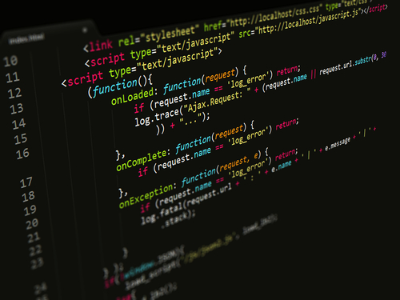

## My Thoughts on Javascript so far?

Javascript is no stranger for me as I've been using it since I was a Junior in Highschool. It was the first programming langauge that I learned and boy did I struggled at first. I went weeks without fully understanding the basic programming fundamentals. But my struggle only escalated when my class begin to cover DOM (Document Obect Model) and more back end programming. It wasn't until I self taught myself the programming langauge Python was I able to not only grasp Javascript but also the many foundations of programming. My intial comparison between Python and Javascript was like comparing English to Hebrew. Python is so easy to read especially with the absence of Javascripts curly braces and what made me love it was that it literally felt like english! I felt that Javascript was very verbose and that Python was the master race. Comparing the Syntax side by side: 

```

Python

fruits = ["Apple", "Oranges"]
for fruits in basket:
    print(fruits)


Javascript

let fruits = ["Apple", "Oranges"];
for (let i = 0; i < fruits.length; i++) {
    console.log(fruits[i]);
}
```
I feel that it is pretty obvious which may look easier to read, especially as a neophyte as myself. But it was thanks to Python that I was able to enjoy and understand Javascript. 

## My Thoughts on the Modules and the Course So Far
So far I love the class! It defintely feels more enjoyable than prior programming courses that I have taken. The entusatthic and fun atmosphere sets the stage for communication and collbaoration which are essential soft skills. This course sets to break the typical antisocial computer geek. In my opinion, I feel that the "Workouts of the Day" are a little stressful at first but it really teachs you how to work under pressure and it forces you to study/review before hand. As for the modules? Well, I currently have a love and hate relationship with them. They seem a little overwhelming but they are pretty informative and get the point. One thing I didn't really enjoy from the modules was the Free Code Camp excersices. Exercises after exercises felt like an eterrnity as I completed each one. I'll admit that it did teach me some knew things. For instance, this following For Loop short hand:

```
for (let element of arr_name)
    console.log(element);

for (let index in arr_name)
    console.log(index)
```

The first For Loop allows you to easily traverse through an Array denoting the respective element with its iteration. In otherwords, I don't have to do the typical arr_name[i] to access each element through an array. The second For Loop allows me to travese through an Array with the Variable index denoting the index in respect to the current itteration. This means that I don't have to use arr_name.length!

## Final Thoughts
Overall, I am truly looking forward to what this course has in store. Looking ahead, I see that we will be immersing ourselves in backend programming and frameworks which are exciting topics that will lead us down the road to becoming a full stack developer!