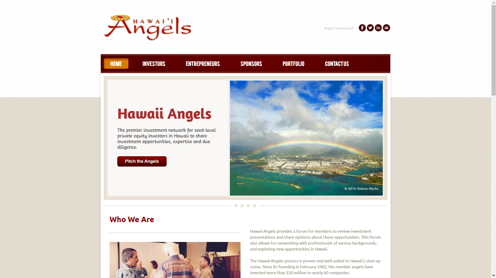
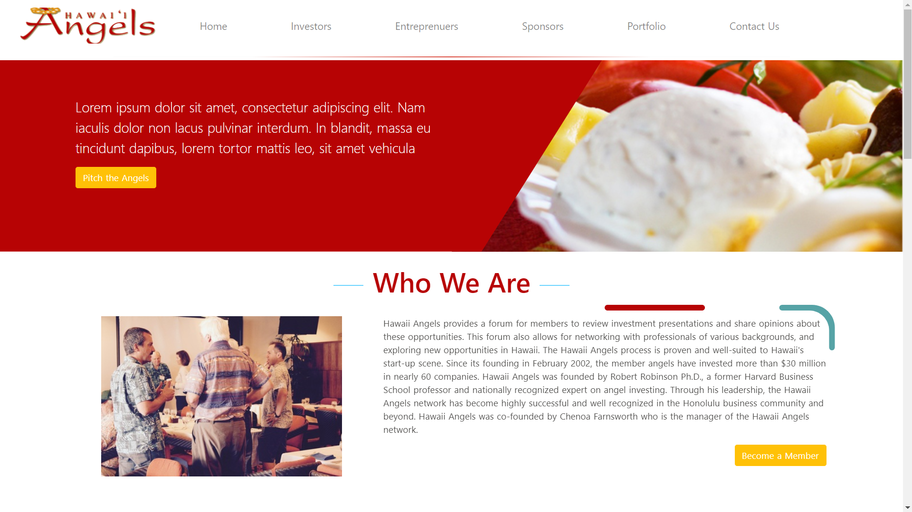

 After high school, my friends and I wanted to create a startup and we were able to get into contact with Blue Startups. They allowed us to expand our portfolio by redesigning their website. We did a 1-week sprint and presented them with an MVP design. Sadly, we had a lot of communication issues and we currently don't have contact with them. We hope that we can regain contact in the future.

# Old Website
<a href="https://www.hawaiiangels.org/">Here is a link to their old website</a>

As you can see this website looks old and out-of-date. The colors don't look visually appealing and the lack of animations makes the website static. Our goal was to make the website more aesthetically appealing, especially since we believed that this website gives the first impression. Initially, we only knew basic web developing so we decided to challenge ourselves by using the Vue Framework.

# New Website
<a href="https://wildcherrybazzaire.github.io/HawaiianAngels/">Here is a link to the new website we were working on. Please note it is still in progress</a>

We wanted to make their website more alive and appealing to the audience. We changed up the color scheme a bit to make it appear more colorful. Turquoise, yellow and a bright shade of red was implemented in hopes to attract an audience. Also, we added animations to make the website appear more dynamic and appear more interactive. Naturally, a website with no animations appears boring and it is a common norm for websites. 

## My Experience
My contributions to this project are front-end design using Vue and Boostrap-Vue. I contributed to developing Vue components and styling elements for each page. Also, I worked on some back end Javascript functionality such as buttons and events. At first, my team and I struggled with using the new framework as we weren't entirely accustomed to it. Overall, this is a project that I will continue working on especially when my team and I will get back into contact with Blue Startups.

