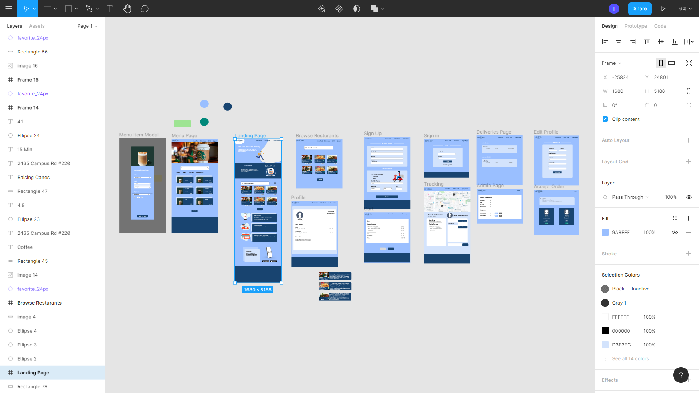
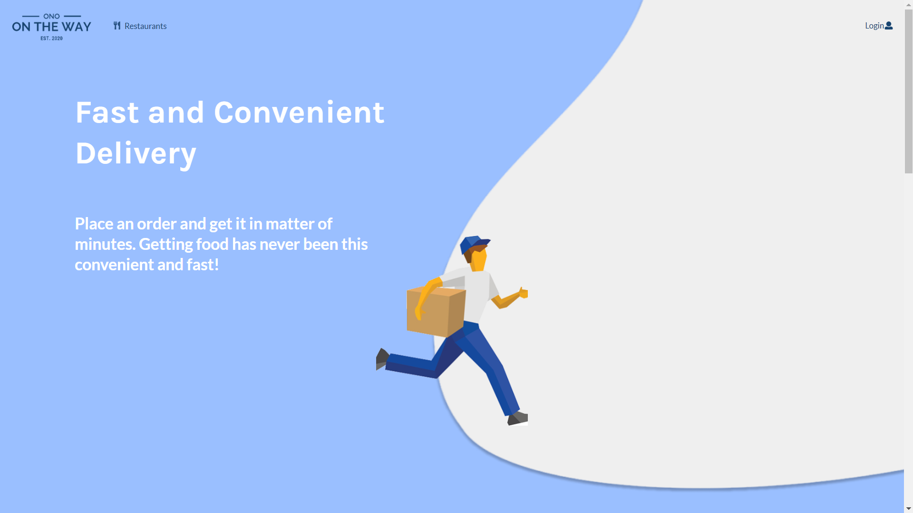

## What is Ono OTW?
Ono OTW is an alternative food delivery service designed for students of the University of Hawaii at Manoa. It strives to offer quick deliveries from none other than UH students themselves. Meaning students can pick up local orders within the UH community and deliver them to students on Campus. The whole idea is to get food in a more efficient approach. Existing delivery services such as Uber Eats and Doordash exists but they take way to long and their delivery time grows exponential when traffic is involved. We came up with the idea of having students deliver food to help solve this issue. For instance, imagine being a student studying for finals or working on a major project. You are hungry but don't have the time nor the patience to get food. Hence, our app comes in. You can easily order food from nearby restaurants and expect the food to be delivered to you within half the average time from other food delivery sources. Furthermore, what makes this implementation so great, is that when it comes down to it, most of us are poor broke college students. We are living off $1 cup noodle and student loans. Our application can help these students make some quick cash without having to put too much effort. An individual can easily deliver a person's order on his/her way to class.

Here are my group's wireframe mockups. In my opinion, this was one of the hardest parts of creating this project. We have this great idea but we have no clue how to form it and what foundation to build it upon. This process of designing took a few weeks of hard brainstorming and redesign. Initially, we planned on going with UH Manoa's colors, but we felt that colors were off and looked bland. Eventually, after discussing and researching potential UI designs, we decided on white and various shades of blue. We also decided on a flat design, in which we created and looked for flat minimalistic art to utilize.

Early Process of Old Design 

New and Final Design

## My Contributions
For this project, I took the role of the project manager and a frontend UI and backend developer. I made sure tasks were done on time and managed the progress of our projects. Sometimes we would host meetings and stands ups to check what we have done and if we have any issues in regards to our task. In terms of UI coding contributions, I worked on the landing page and the add restaurant page. These pages were implemented using React.js library, Meteor framework, and the Semantic UI styling framework. Also, I worked on creating and editing various MongoDB database collections for another aspect I was in charge of which was implementing the Google Maps API. The Google Maps API was a little challenging to implement at first since I have only done it with plain Javascript, not with the React.js library and Meteor framework. After playing around with Geocoding and the Google Maps API, I was able to figure it out and fully implement google maps to our site. Initially we had users input their delivery address but now our application gets their location for us, and if they want to they can change/input it manually.

Landing Page

## What Happens Next?
This is a project that I enjoyed. After discussing with my group, we are thinking about continuing development during the summer. We felt that this is a project that has a lot of potentials and we want to see it come to life and blossom. Something we plan to implement is Hotjar and Google Analytics which are tools to help us collect data on our user experience. This is a really important thing to take note of because no one wants to use an application that gives them a horrible experience. Overall, I can't wait to continue working on this project and to finally implement it for our fellow UH students and community.