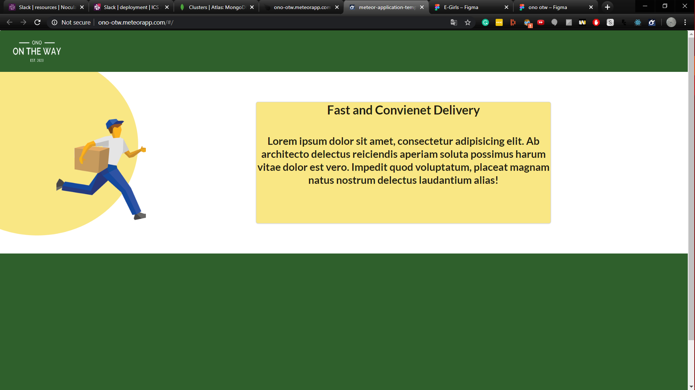

## What is Ono OTW?
Ono OTW is a alternative food delivery service designed for students of the Unveristy of Hawaii at Manoa. It strives to offer quick deliverys from none other than UH students themselves. Meaning students can pick up local orders within the UH community and deliver them to students on Campus. The whole idea is to get food in a more efficient approach. Existing delivery services such as Uber Eats and Doordash exists but they take way to long and their delivery time grows exponential when traffic is involved. We came up with the idea of having students delivery food to help solve this issue. For instance, imagine being a student studying for finals or working on a major project. You are hungry but don't have the time nor the patience to get food. Hence, our app comes in. You can easily order food from nearby resturants and expect the food to be delivered to you within half the average time from other food deilvery sources. Furthermore, what makes this implementation so great, is that when it comes down to it, most of us are poor broke college students. We are living off $1 cup noodle and student loans. Our application can help these students make some quick cash without having to put to much effort. An individual can easily deliver a person's order on his/her way to class.

Here is my group's wireframe mockups. In my opinon, this was one of the hardest part of creating this project. We have this great idea but we have no clue how to form it and what foundation to build it upon. This process of designing took a few weeks of hard brainstorming and redesign. Intiallly, we planned on going with UH Manoa's colors, but we felt that colors were off and looked bland. Eventually, after discussing and researching potetnial UI designs, we decided on white and various shades of blue. We also decided on a flat design, in which we created and looked for flat minamalistic art to utilize.

Early Process of Old Design 

New and Final Design

## My Contributions
For this project I took the role of the project manager and a frontend UI and backend developer. I made sure tasks were done on time and managed the progress of our projects. Sometimes we would host meetings and stands ups to check what we have done and if we have any issues in regards to our task. In terms of UI coding contributions, I worked on the landing page and the add resturant page. These pages were implemented using React.js library and the Semantic UI styling framework. In addition, I worked on creating and editing various MongoDB database collections in respect to another aspect I was in charge of which was implementing the Google Maps API.

## What Happens Next?