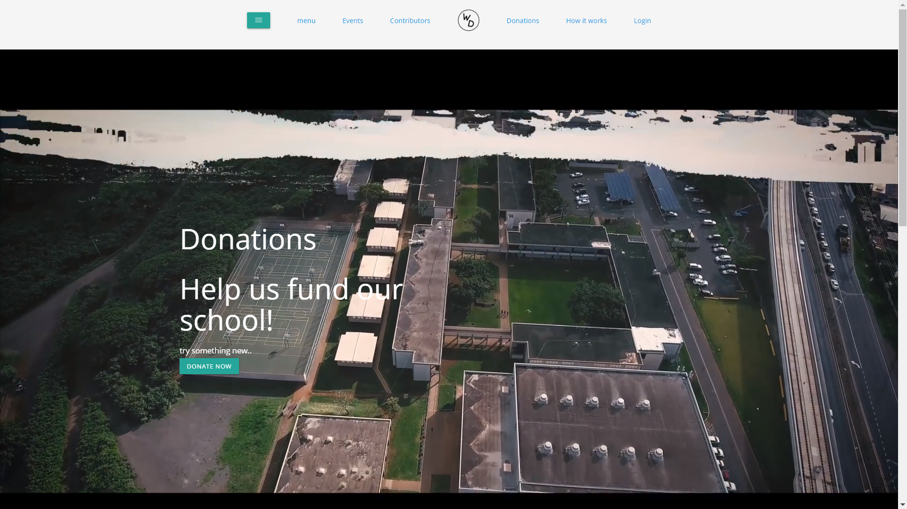
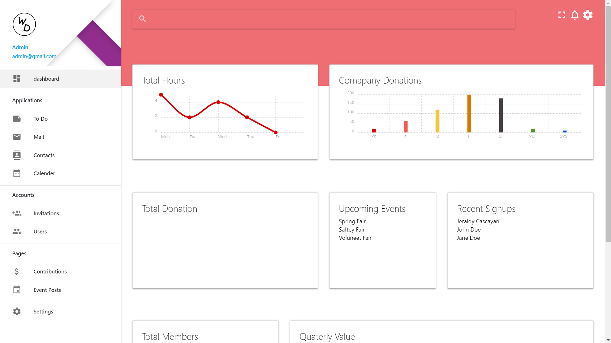

WHS Devs is a web application that I helped create as a team project in my highschool programming class, February 2019. The project helped me learn how to design websites and utilize databases. 

The purpose of this project is to give recognition to Waipahu High School Business Partners and to provide our client with a dashboard in which she can organize data in relation to donations and partners in an easy and efficent matter.

In this project I was in charge of backend database programming and provided assistance with the UI Design. I gained experience with using Google Firebase, implementing a login system and using the Materalize libaray to help style the website. This website is currently MVP and may be revisited in the future.

 
Source: <a href="https://timstomatos.github.io/whs_devs/pages/homePage2.html"><i class="large github icon"></i>WHS Devs</a>