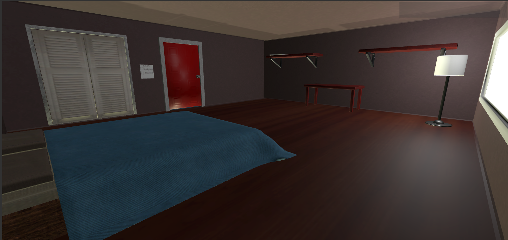
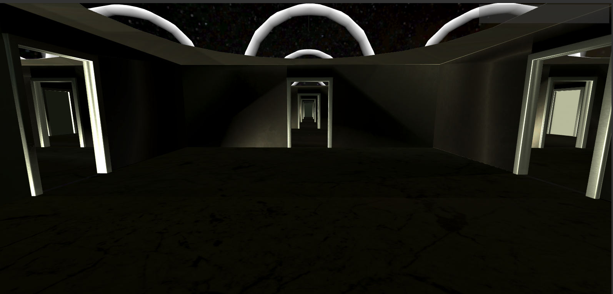

Wayne's World is a project I worked on with my teammates for Global Game Jam 2019. This is an international event in which individuals across the world dedicate 2 days of their time to create a game. The theme for this Jam was Home, so we decided to make our game follow the abstract ideolgy that home is your family. With that in mind, the premise of the game is as follows:

"One night a little boy named Wayne has an intense argument with his parents in which results in him hating and despising them. He goes to sleep but then enters a dream world where he can't leave until he find specials childhood items that reminds him of his parents love and bond."

For this project I was the main programmer. I started by programming the foundations such as basic movement and camera controls, then slowly creeped up to adding additonal mechanics such as random events and spawning. I would also take care of the UI design, displaying objects that our main character Wayne has collected throughout his journey through this mystical dream world. I created each stage with the first being Wayne's Bedroom, the second being a gallery and the third being a never ending hallway. The bedroom is where you can select what place you want to vist in Wayne's dream. If you have Wayne vist the gallery he will be tasked to find his beloved teddy bear that his mother gave him 2 years a go.

 The teddy bear is hidden with the paintings amongst the gallery, and selecting the wrong painting will trigger random tiles to fall. This is where the random event aspect comes in, but it also comes from the fact that the bear will randomly teleport every 15 seconds making finding the bear a rather challenging task.  

 The other place to visit is the never ending hallway. Every direction you look, will appear to look exactly the same. Rooms upon rooms in which you will have no sense of where you truly are. The task in this place is to have Wayne find his favorite blanket his father used to comfort him whenever there was scary lightning storms.

When ever I partcipate in a Hackathon or a Game Jam I always learn something new regardless of the tools and assets I use. During this Game Jam I was able to learn how to manipulate and create random events. To do such a task, I would have most events rely on a randomly generated value in which changes every so often with a timer. This would allow me to have objects such as the teddy bear spawn in different locations and have random tiles fall when ever you select the wrong painting. Overall, this Game Jam was really enjoyable and althought the game isn't a complete product I am proud that I was able to help create such a game with a very limited amount of time.

Source: <a href="https://github.com/jogarces/ics-313-text-game"><i class="large github icon "></i>jogarces/ics-313-text-game</a>

