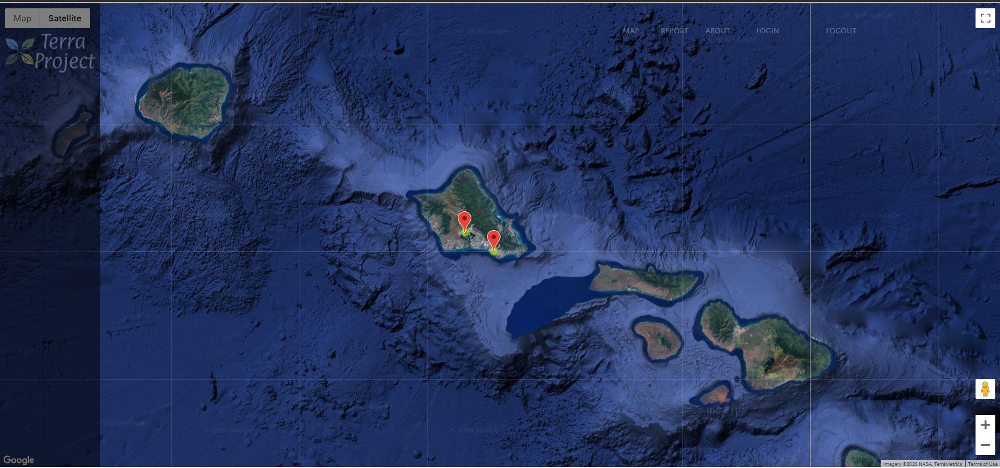

## What is Terra Project?
Here is the abstract for my project:

For a while, many individuals overlooked the littering crisis and are taking it for granted due to the longevity of the issue. There are those who want to help the environment but there are also individuals who don't know where to start. Therefore, the creation of an easily accessible collection of statistical data for littering cases will help inform organizations/volunteers who want to help this littering crisis. The project will consist of two key components, a Website, and a Machine Learning Mobile Application. The Mobile Application uses Machine Learning to scan and identify trash in the designated area in real time with the phone's camera. A screenshot can be taken and uploaded to the website. The website will then geolocate the submission along with the user's comments. A heat map will be implemented to help display the severity of littering in that area. Once, these aspects are implemented, organizations/individuals who want to help the environment will get an idea of where they can start cleaning. Overall, this project will help those who want to change our environment and resolve this littering crisis.

This project was a solo project so I did all of the programming and presentation. I already had some experience with Web Development but the problem was what I should use to make the mobile applicaton. At first I was thinking of Unity, Flutter or just having a mobile responsive web client but once again I wanted to try something new. This end in me choosing Android Studio. At the time I was learning Java as well so it was a great way to apply what I learned from my ICS 111 class. I developed the website with basic Web Development tools (HTML, CSS, JS) and I used Google Firebase as my backend database to store user credientials and litter submission.

One of the main things I learned was basic Machine Learing concepts and fundamentals. I spent time doing extensive research on Machine Learning, taking part in some online courses especially ones taught by Andrew Ng. Furthermore, I learned how to use Android Studio which gave me another take on how to develop mobile applications. Learning various methods to create software helps you be more flexible when working with others in the future. One last thing I learned was how to use the Google Maps API, allowing me to encode and decode location to coordinates and to create heat maps with them.

This is defintely one of the projects that I will revist in the future mainly because a lot of judges thought it was a great idea. There are a few issues here and there but I feel that once I become more proficent in Data Science I can repolish it and hopefully release it as open source project. 